# VMRay Report Phishing Outlook Add-in Deployment Guide

This repository contains the components and instructions to deploy the VMRay Report Phishing Add-in for Outlook. This add-in allows users to report suspicious emails directly to a VMRay Incident Response (IR) mailbox for automated analysis.

---

## Introduction

### Outlook Add-ins

Outlook Add-ins enhance the user experience by integrating custom features directly into the Outlook interface. They leverage web technologies to provide seamless functionality across desktop, web, and mobile Outlook clients.

### About VMRay

VMRay is a leading platform for automated malware detection and analysis. Using advanced sandboxing and hypervisor-based monitoring, VMRay delivers deep insights into sophisticated threats. This add-in streamlines the process of reporting potential phishing emails from Outlook to the VMRay platform.

Key features of the add-in include:

* Report suspicious emails with a single click
* Forward original email content (including attachments) to a VMRay IR mailbox
* Moving the mail to a dedicated folder

---

## Prerequisites

Before deployment, ensure the following:

* **Azure Portal Access** – Required to create Web Apps and register applications.
* **Microsoft 365 Global Admin** – Required for add-in deployment and permissions.
* **VMRay IR Mailbox** – The email address to receive reported phishing attempts.

---

## Azure Web App

### 1. Create an Azure Web App

1. Log in to the [Azure Portal](https://portal.azure.com).
2. Navigate: **Create a Resource → Web App → Create**.

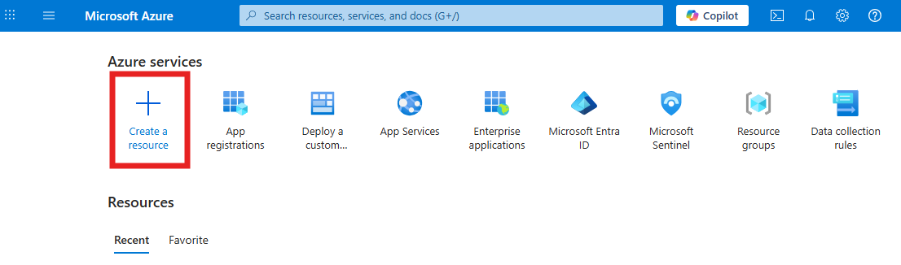

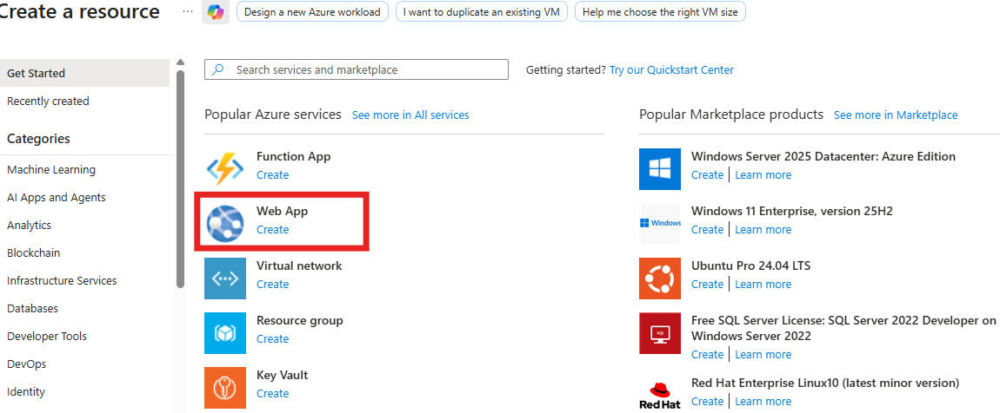

### 2. Fill in Web App Details

| Field                | Value                                                      |
| -------------------- | ------------------------------------------------------------------------ |
| **Subscription**     | Your Azure subscription                                                  |
| **Resource Group**   | Create New: `OutlookAddin`                                                    |
| **Name**             | Unique name for your app → forms URL: `https://<name>.azurewebsites.net` |
| **Publish**          | Code                                                                     |
| **Runtime Stack**    | Node.js 22                                                               |
| **Operating System** | Linux                                                                    |
| **Region**           | Closest to your users                                                    |
| **Plan / SKU**       | Free/Basic for testing; B1 or higher for production                      |


### 3. Review and Create

1. Click **Review + Create → Create**.


2. Wait a few minutes for deployment to finish.
3. Click on `Go To Resource`


### 4. Get Your Web App URL

1. Navigate to **Overview** → Copy the **Default Domain**.

```
https://yourdomain.azurewebsites.net
```

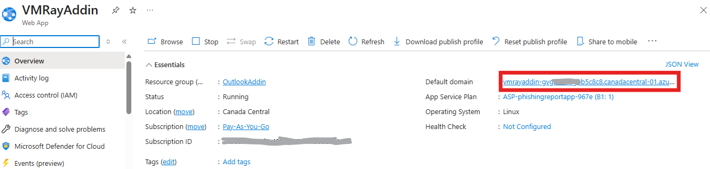

> This URL will be used in:
>
> * Azure AD App Registration (OAuth redirect URIs)
> * Outlook Add-in manifest `<SourceLocation>`

---

## Azure AD App Registration

### 1. Register a New App

1. Navigate: **Azure Active Directory → App registrations → New registration**

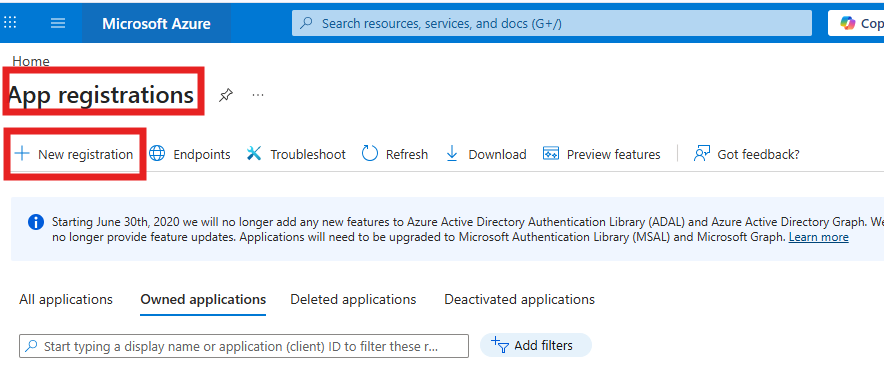

2. Fill in:

| Field                       | Value / Instructions              |
| --------------------------- | --------------------------------- |
| **Name**                    | `Outlook Phishing Add-in`         |
| **Supported account types** | Single tenant (organization only) |
| **Redirect URI (optional)** | Leave blank (configured later)    |

3. Click **Register**.

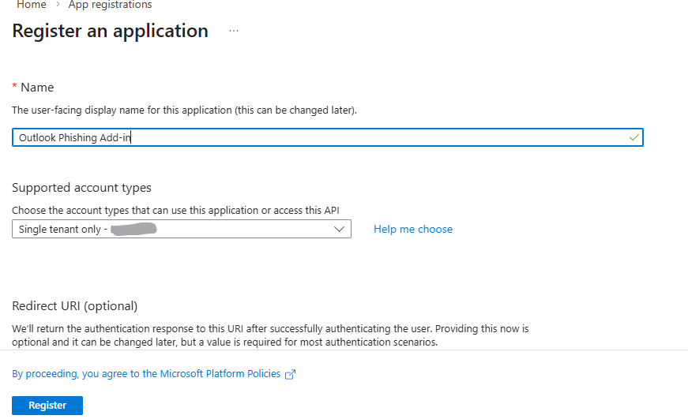

4. Note **Application (client) ID** → `CLIENT_ID`
   Note **Directory (tenant) ID** → `TENANT_ID`

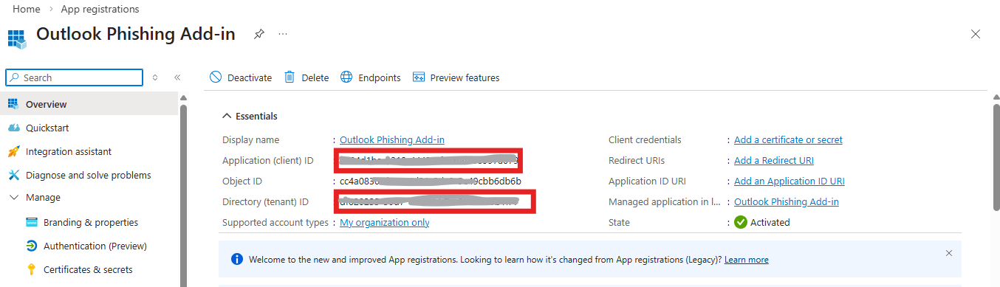

### 2. Create a Client Secret

1. Navigate: **Certificates & secrets → New client secret**

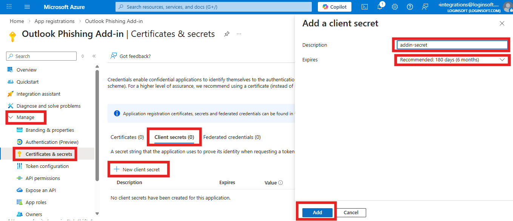

2. Fill in:

| Field       | Value          |
| ----------- | -------------- |
| Description | `WebAppSecret` |
| Expires     | 6 or 12 months |


3. Click **Add** → Copy the secret value → `CLIENT_SECRET`

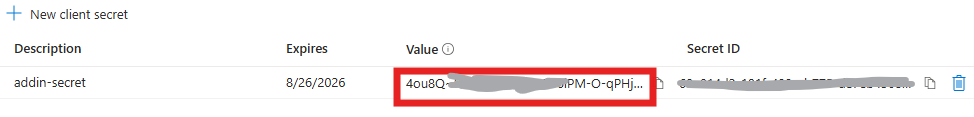

### 3. Add API Permissions

1. Navigate: **API permissions → Add a permission → Microsoft Graph → Delegated permissions**

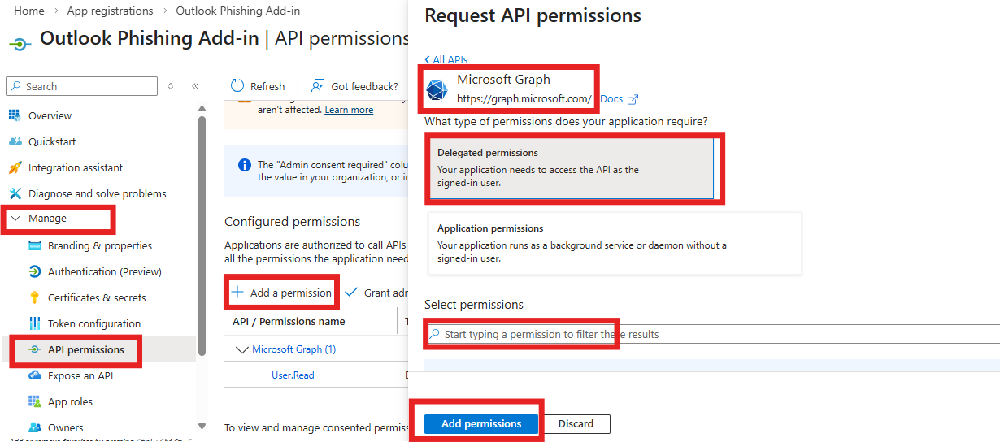

2. Add:

* `Mail.Send`
* `Mail.ReadWrite`

3. Click **Grant admin consent for [Tenant]**

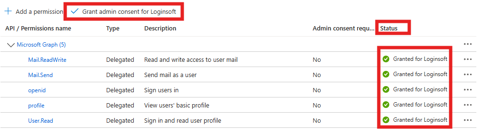

### 4. Configure Application URI and Scopes

1. Navigate: **Expose an API → Set Application ID URI**

```
api://<WebAppDomain>/<ClientID>
```

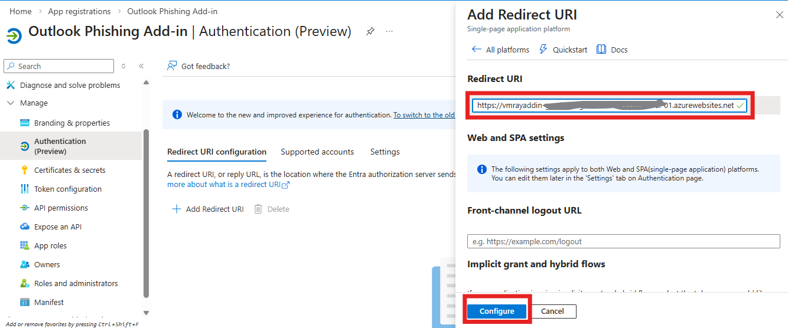

2. Click on `Add a Scope` 

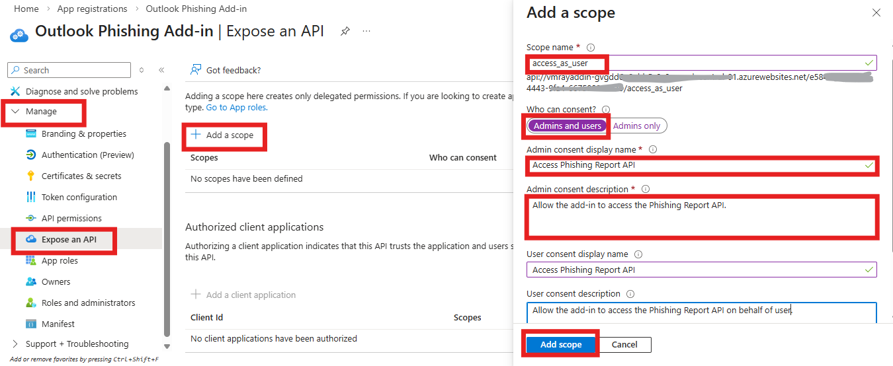

| Field                      | Value                                                      |
| -------------------------- | ---------------------------------------------------------- |
| Scope name                 | access_as_user                                             |
| Who can consent            | Admins only                                                |
| Admin consent display name | Access Phishing Report API                                 |
| Admin consent description  | Allows Outlook add-in to call backend for phishing reports |


3. Next Click on  **Client Applications** and Add both Client Application IDs

 **Client ID** 
 and Office apps ID `ea5a67f6-b6f3-4338-b240-c655ddc3cc8e` 

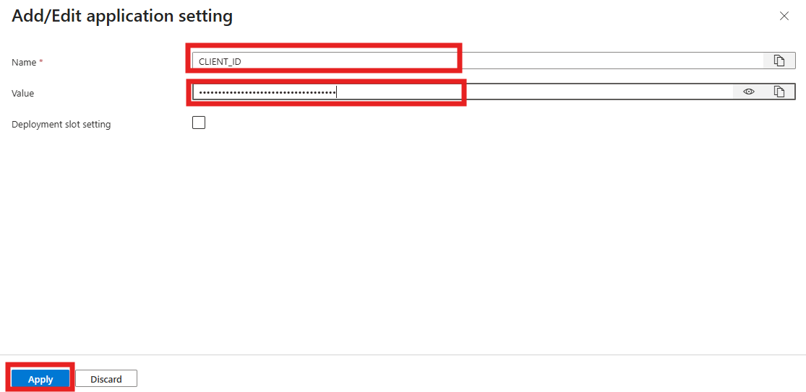

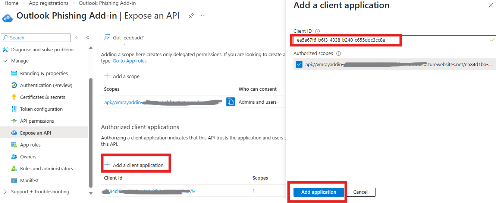

### 5. Configure SPA Redirect URIs

1. Navigate: **Authentication → Add a platform → Single-page application (SPA)**

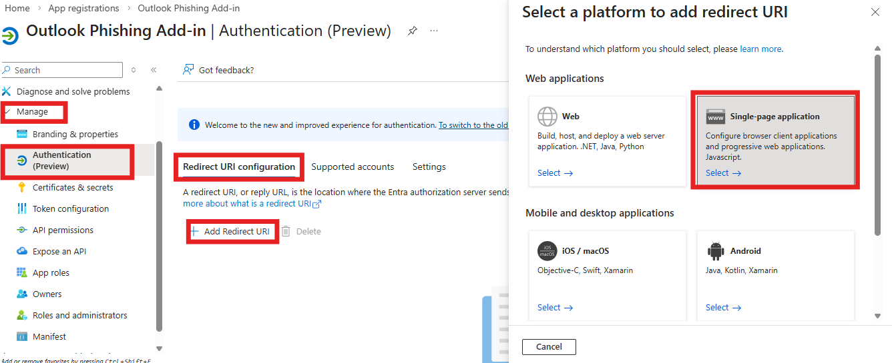

2. Add URIs :

```
https://<WebAppDomain>
https://outlook.office365.com
https://outlook.office.com
```

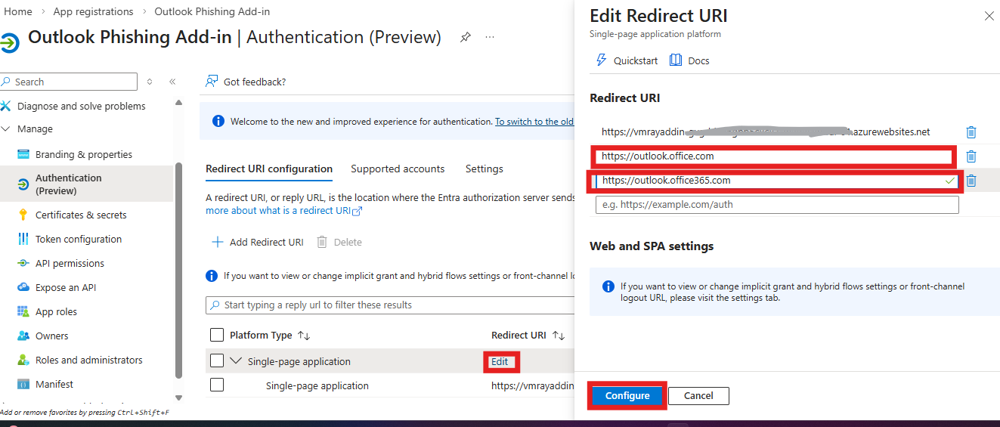

3. Click **Configure**

---

## Configure Web App Environment Variables

1. Navigate: **Azure Portal → Web App → Settings → Configuration → Application settings**

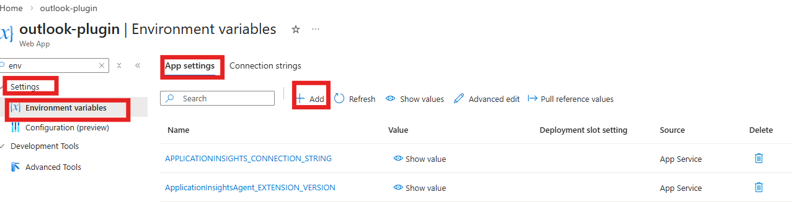

2. Add environment variables:


| Name              | Value                    | Notes                                                                        |
| ----------------- | ------------------------ | ---------------------------------------------------------------------------- |
| CLIENT_ID         | Azure AD App Client ID   | From App Registration                                                        |
| CLIENT_SECRET     | Client secret            | From App Registration                                                        |
| TENANT_ID         | Azure AD Tenant ID       | From App Registration                                                        |
| DESTINATION_EMAIL | Email to receive reports | Example: [securityteam@yourcompany.com](mailto:securityteam@yourcompany.com) |

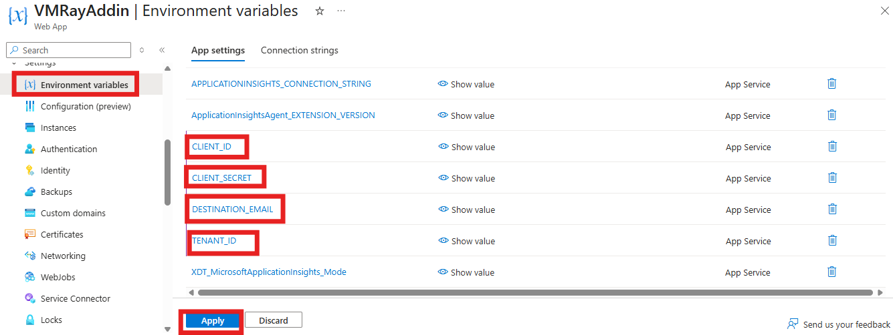

3. Click on Apply and Confirm for app restart
---

## Prepare and Deploy Outlook Add-in Code

### 1. Update Code Before Deployment

Modify below files with appropriate values as shown below
| File         | Key / Setting                 | Update Instruction                            | Required |
| ------------ | ----------------------------- | --------------------------------------------- | -------- |
| manifest.xml | WebApplicationInfo → Id       | Paste **Client ID**                           | ✅        |
| manifest.xml | WebApplicationInfo → Resource | Paste **Application URI**                     | ✅        |
| taskpane.js  | API calls / URLs              | Replace placeholder domain with Web App URL   | ✅        |
| server.js    | aud                           | Replace with **Application URI**              | ✅        |
| config.js    | Messages / Emails             | Customize optional messages/destination email | ⚪        |


### 2. Push Code to GitHub

```bash
git init
git add .
git commit -m "Update Azure AD & Web App settings"
git remote add origin https://github.com/<username>/<repo>.git
git branch -M main
git push -u origin main
```

### 3. Deploy to Azure Web App

1. Navigate: **Deployment Center → GitHub**
2. Authenticate GitHub → select repo and branch → Click **Finish**

### 4. Verify Deployment

1. Open Web App URL: `https://<WebAppDomain>`
2. Test endpoint:

```
https://<WebAppDomain>/health
```

Expected: `{"status":"OK"}`

### 5. Configure Always On

```
Settings → Configuration → General Settings → Always On → Enabled
```

Restart Web App.

---

## Microsoft 365 Deployment

### 1. Upload Custom Add-in

1. Open a new tab and navigate to [admin.cloud.microsoft](https://admin.cloud.microsoft).
2. Navigate to Settings → Org settings → Add-ins


3. Now Click on  Deploy Add-in → Upload Custom Add-in**


4. Browse and select `manifest.xml`

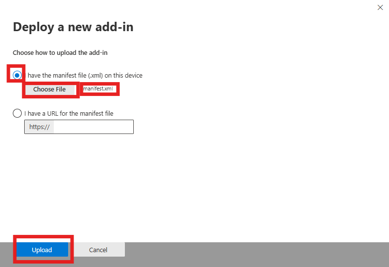

### 2. Configure Deployment Options

* Assign to **All Users** or **Specific Users/Groups**
* Deployment type: **Fixed** or **Avaliable** or **Optional**


* Click **Next**
* Click on **Save** 

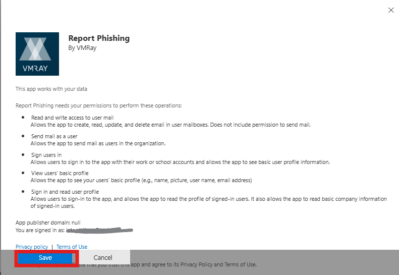

* You will get successful addin deployment. Click on **Next** and then  **Close**

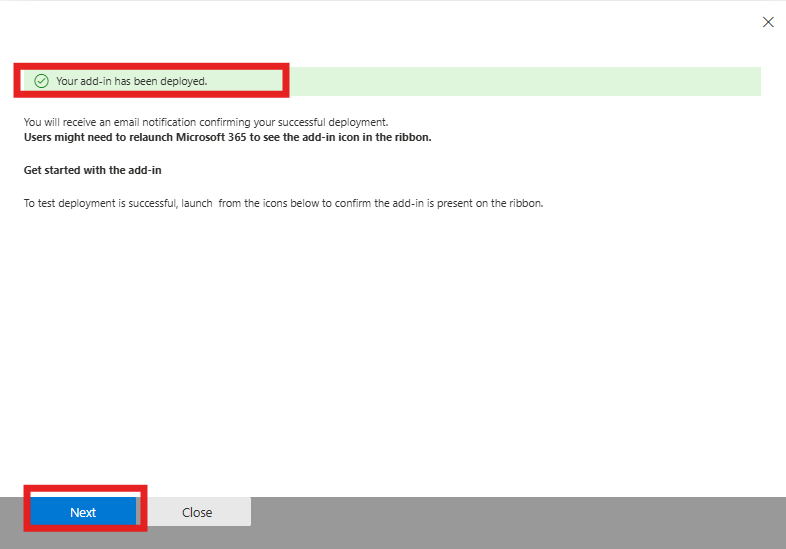


### 3. Verify Add-in Availability

After deployment, the add-in behavior depends on the deployment method selected in the Microsoft 365 Admin Center.

#### If You Selected **Fixed Deployment**

* Open **Outlook Web (OWA)**.
* Open any email message.
* The add-in should appear automatically in the **top-right action bar** of the message window.

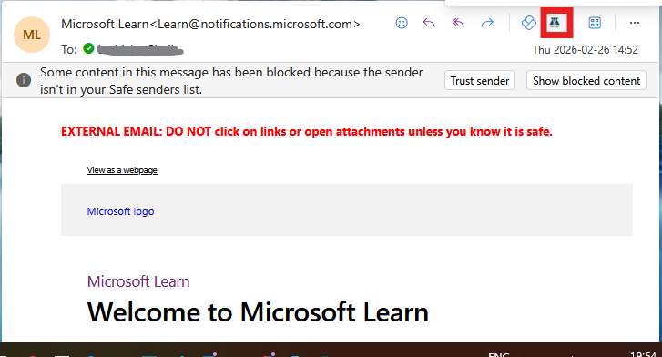

* Click the add-in icon to launch the task pane.


* Click 'Confirm' button to report a mail.


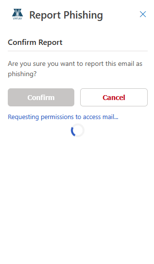

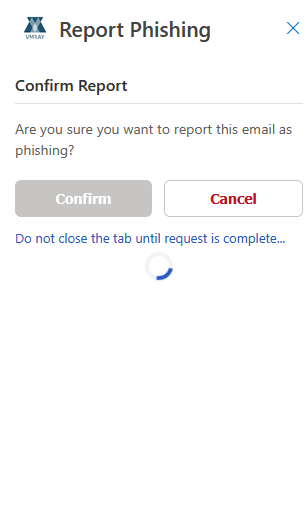

* You can see the success message after reporting is done.

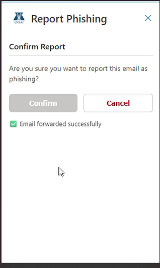

If the add-in does not appear:

* Refresh the browser page.
* Sign out and back in to Outlook Web.
* Wait a few minutes (deployment propagation can take time).

---

#### If You Selected **Optional Deployment**

* Open **Outlook Web (OWA)**.
* Open any email.

* Click the **Apps** icon (or **“More apps” / three dots menu**) in the message action bar.


* Locate the VMRay Report Phishing Add-in in the list.
* Select it to launch the task pane.

Users may also need to:

* Click **Get Add-ins**  and ensure the add-in is enabled.
* Refresh the browser after first-time assignment.


#### Outlook Desktop

* Restart Outlook after deployment.
* Open an email message.
* The add-in should appear in the ribbon (typically under in **Apps** or **Add-ins** section).


If the add-in is still not visible:

* Confirm the user is assigned in the deployment group.
* Verify the manifest uploaded successfully.
* Allow up to 30 minutes for Microsoft 365 propagation.


---

## Post-Deployment Validation Checklist

* Outlook Add-in is visible in Web/Desktop clients
* SSO authentication works without errors
* Reporting a sample email forwards it to **DESTINATION_EMAIL**
* Task pane messages appear correctly
* Web App `/health` endpoint returns `{"status":"OK"}`

---

## Troubleshooting

| Issue                            | Resolution                                                          |
| -------------------------------- | ------------------------------------------------------------------- |
| SSO token fails / pop-up blocked | Check SPA Redirect URIs, disable browser tracking protection and Enable cookies        |
| Emails not forwarded             | Verify `DESTINATION_EMAIL` and API permissions                      |
| Manifest errors                  | Confirm `WebApplicationInfo → Id` and `Resource` match Azure AD app |

---
